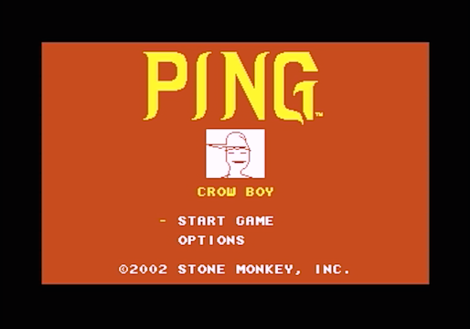
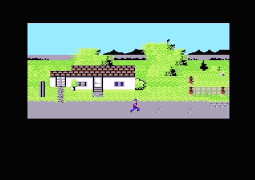
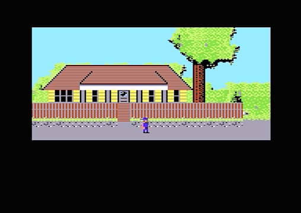

[(video)](http://www.youtube.com/watch?v=BveeejVGICs)

 This is a demonstration of a side-scroller involving a character that can run and jump around. It was started a while back as a college project, but was eventually abandoned. I decided to put the source online after fixing some bugs and other issues, in case anybody finds it useful. The code is not the cleanest ever, but can be freely used as a basis for other projects. If you do decide to use any of the code, please share a link. Bug fixes/improvements are also welcome.

Currently, only PAL is supported. The game will still run in NTSC mode, but graphics and sound may not behave properly.

- Website: [c64-crowboy-demo](http://de-mux.github.io/c64-crowboy-demo)
- CSDB page: [Crow Boy [2016]](https://csdb.dk/release/?id=144552)

## Build

This project requires a POSIX system, DASM and pucrunch(see Tools Used, below).

From the `src` directory, type:

    make

If all goes well, you should end up with `crowboy.prg` which you can then run on an emulator.

To clean up object files, type:

    make clean

## Project Organization

**Main**

- `boot.a` is the main assembly file and includes all other files.
- `logo.a` displays an animated C64 logo before the main menu.
- `menu.a` contains the main menu routine.
- `game.a` contains the game/level setup routines as well as the main game interrupt and joystick reading routines.

**Objects, sprites**

- `objects.a` keeps track of objects(generally tied to sprites) in the game world. It also keeps track of state of each object. The `RequestAction` routine is used to request objects do things, including the player object.
- `sprite_info.a` contains data about sprite animation sequences and X offsets for each frame.
- `graphics.a` handles offscreen graphics buffers and copying the buffers and sprite positions/pointers to VICII memory.

**Screen and text**

- `screen.a` mostly has routines for manipulating the VICII screen. Of interest are the routines for fading in and out a screen using an offscreen color buffer. See also `color_fade_table.a`.
- `text.a` contains routines for drawing text to the screen.

**IRQ**

- `irq.a` is the IRQ driver and contains the low-level interrupt routines as well as setting up the interrupt vectors.

**Utils, etc**

- `util.a` contains some basic low-level routines.
- `macros.a`, `constants.a` and `system.a` are pretty much how they sound. They do not contain any code.

`loader.a` is currently not used, but was intended to allow more data to be loaded from a disk.

## Sprites

Individual sprites are in `sprites/*.SPR` -- they are in C64 file format(i.e. 2 origin bytes at the beginning of the file) and can be loaded by the sprite editor.
These sprites are all compiled into a single file, `sprites/gamesprites.spr` which is included in the assembly file. See `sprite_info.a` to see descriptions.

`sprite_info.a` contains info about sprite sequences and offsets.

## Music

Music files are created using VoiceTracker. The .mus files can be loaded directly from VoiceTracker. The .bin files are the relocated versions(with the 2-byte origin headers removed) to be included directly in the assembly.

## Levels

Each byte of level data corresponds to a 2x2 character block. Blocks are defined in the `.blocks` files and levels are defined in `.level` files. There are 3 versions of the level/block/charset editor in the `tools` directory for different operating systems: Mac OS 9, OS 10.4, and Windows. Unfortunately the original source code is lost, so newer versions will not be available. However, with some effort you may have luck with one of the generic level editors out there.

To use the level editor, you need to load 4 things in order to edit a level: the `.chr` file, the `.colortable` file, the `.blocks` file, and finally the `.level` file.

## Tools Used

- [DASM](http://sourceforge.net/projects/dasm-dillon/) 2.20.11 20140304 - Assembler
- C1541 (included with [VICE](http://vice-emu.sourceforge.net/) emulator) - .D64 manipulation tool
- [SpriteWorld](http://csdb.dk/release/?id=31201) - sprite editor
- [VoiceTracker](http://csdb.dk/release/?id=2665) 4.2 - music tracker
- [pucrunch](https://github.com/mist64/pucrunch) - byte cruncher

## Screenshots

